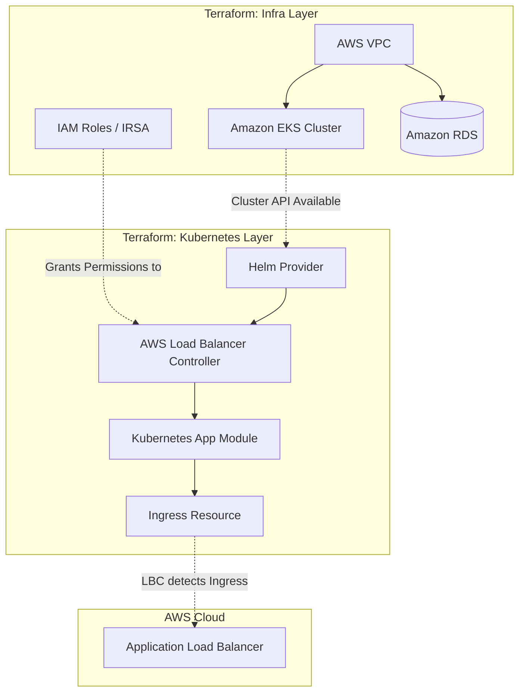

# What I Learned Building This Project

This document details the architectural decisions, technical challenges, and key learnings from building this multi-stage Amazon EKS infrastructure using Terraform.

## 1. Why Terraform?
Terraform was chosen because it provides a declarative, cloud-agnostic approach to Infrastructure as Code (IaC). It tracks the exact state of the deployed resources, calculates the delta between the desired code and reality, and applies only the necessary changes. It is the industry standard for AWS infrastructure provisioning.

## 2. Terraform Project Structure
The project avoids a monolithic design in favor of strict layer and environment isolation:
- **Environment Isolation:** Dev, Staging, and Prod are completely separate directories. This prevents a configuration error in Dev from accidentally breaking Prod (a common risk when using Terraform workspaces).
- **Layer Isolation:** Inside each environment, `infra` (AWS resources) and `kubernetes` (Helm/K8s resources) are strictly separated.

## 3. Terraform Workflow
The core workflow used throughout this project is:
- `terraform init`: Initializes the directory, downloads provider plugins (AWS, Helm, Kubernetes), and connects to the backend.
- `terraform validate`: Verifies syntax and internal consistency before talking to the cloud.
- `terraform plan`: Dry-run that shows exactly what will be created, modified, or destroyed.
- `terraform apply`: Executes the planned changes against the AWS API.

## 4. Terraform State
Terraform uses a state file (`terraform.tfstate`) to map your code to real-world resources.
- **Local vs Remote State:** By default, state is stored locally. This project uses **Remote State** stored in an S3 bucket.
- **Why S3?** Remote state enables team collaboration (everyone shares the same state) and prevents conflicts.
- **Why not Git?** State files often contain plaintext secrets (like the RDS master password). Committing them to Git is a massive security risk.
- **State Separation:** Because the project uses separate directories (`dev/infra`, `dev/kubernetes`), each layer maintains its own small, isolated state file in S3.

## 5. Why Separate Backend Bootstrap?
The S3 bucket that holds the Terraform state must exist *before* any other Terraform code can run. The `backend/` directory is applied first, entirely locally, to create the bucket. Once the bucket exists, the rest of the project is configured to use it as a remote backend.

## 6. Why Separate Infra and Kubernetes Layers?
This is one of the most critical learnings in Terraform EKS deployments.

**The Problem:**
If you put EKS creation and Kubernetes provider usage in the same Terraform state:
1. Terraform attempts to initialize the `kubernetes` provider during the `plan` phase.
2. The provider tries to talk to the EKS cluster API.
3. The cluster doesn't exist yet (because `apply` hasn't run).
4. Terraform fails with an authorization or connection error.

**The Solution:**
By separating them into two roots (`infra` and `kubernetes`), the infrastructure layer runs first and creates the EKS cluster. The Kubernetes layer runs second, safely retrieving the credentials of the *already existing* cluster via AWS data sources.

## 7. VPC
The Virtual Private Cloud (VPC) provides the network foundation:
- **Public Subnets:** Reachable from the internet (via Internet Gateway). This is where the AWS ALB is placed.
- **Private Subnets:** No direct internet access. EKS worker nodes run here for security. Outbound internet access (to download container images) is routed through a NAT Gateway.
- **Database Subnets:** Highly restricted subnets for the RDS instance.

## 8. EKS
Amazon Elastic Kubernetes Service manages the Kubernetes control plane.
- **Worker Nodes:** EC2 instances grouped into Managed Node Groups. They handle the actual application pods.
- **Networking:** The AWS VPC CNI plugin assigns native VPC IP addresses directly to Kubernetes pods.

## 9. IAM and IRSA
IRSA (IAM Roles for Service Accounts) solves the problem of giving pods AWS permissions.

```text
Pod (AWS LBC) --> Kubernetes ServiceAccount --> OIDC Provider --> AWS IAM Role --> AWS API
```
Instead of attaching a broad IAM policy to the EC2 worker node (which every pod on that node could exploit), IRSA uses OpenID Connect (OIDC). It cryptographically links exactly one Kubernetes ServiceAccount to one IAM role. The AWS Load Balancer Controller uses this to securely provision ALBs.

## 10. AWS Load Balancer Controller
Standard Kubernetes Ingress resources don't natively understand AWS. 
The AWS Load Balancer Controller runs as a pod in the cluster. It watches for `Ingress` resources and automatically makes AWS API calls to provision, configure, and route an Application Load Balancer (ALB) to the correct pods.

## 11. Kubernetes Resources
- **Namespace:** Logical isolation for the app (`app`).
- **Deployment:** Ensures exactly `app_replica_count` NGINX pods are always running.
- **Service (ClusterIP):** Provides a stable internal IP for the pods.
- **Ingress:** Defines the external routing rules that the LBC uses to configure the ALB.

## 12. Helm
Helm is the package manager for Kubernetes. Instead of writing hundreds of lines of raw YAML to install the complex AWS Load Balancer Controller, the Terraform `helm` provider installs the official community-maintained Helm chart with a few simple `set` blocks.

## 13. RDS
The PostgreSQL database is provisioned by Terraform in the infrastructure layer.
- **Why outside Kubernetes?** Running stateful databases inside Kubernetes requires complex persistent volume management. Managed RDS is far more reliable and easier to back up.
- **Security:** It is placed in a private database subnet. The security group strictly allows port 5432 ingress *only* from the EKS worker nodes' security group.

## 14. Environment Separation
The project uses strict directory separation (`dev`, `staging`, `prod`) rather than Terraform workspaces.
Workspaces share the same backend state file structure and the same code. If you make a breaking syntax error in a workspace, it breaks `terraform plan` for all environments. Directory separation completely isolates the blast radius.

## 15. Complete Deployment Flow



## 16. What Happens During a Request?
1. A user visits the ALB URL in their browser.
2. The ALB receives the request on the public internet.
3. The ALB looks at its target groups and routes the request directly to the private IP address of an NGINX pod (IP Mode routing).
4. The NGINX pod processes the request and returns the HTTP response.

## 17. What Happens During terraform apply?
1. Terraform reads the `.tf` files and queries the current state from S3.
2. It queries AWS/Kubernetes to check the real-world status of resources.
3. It builds a dependency graph (e.g., VPC must exist before EKS; EKS must exist before Node Groups).
4. It creates, updates, or deletes resources via API calls in the correct order to match the desired code state.

## 18. Common Problems I Encountered
- **IDE "Unexpected Block" Errors:** The Terraform VS Code extension often flagged `kubernetes` and `set` blocks inside the `helm` provider as errors. This happens because the IDE initializes at the workspace root, missing the `.terraform` schema caches in the subdirectories.
- **Destroy Dependency Hanging:** Trying to destroy the VPC/EKS infra layer before destroying the Kubernetes layer caused Terraform to hang indefinitely because the Kubernetes provider couldn't reach the deleted EKS API to clean up the Helm releases.

## 19. Things I Would Improve for a Real Production System

**CURRENT IMPLEMENTATION:** The project demonstrates a highly robust, isolated, production-style foundation.
**POSSIBLE FUTURE IMPROVEMENTS:**
- **Secret Management:** Currently, the RDS password is a Terraform variable. In a true production system, it should be generated randomly by Terraform and stored directly in AWS Secrets Manager.
- **State Encryption Key:** Use a custom AWS KMS key for the S3 backend instead of standard Amazon S3 managed keys (SSE-S3).
- **GitOps:** Move the Kubernetes application deployment layer out of Terraform entirely and use a GitOps tool like ArgoCD or Flux.

## 20. Interview Questions

**Q: Why use Terraform over AWS CloudFormation?**
A: Terraform is cloud-agnostic, has a massive open-source ecosystem, supports multiple providers (like AWS, Helm, and Kubernetes simultaneously), and uses the highly readable HCL syntax.

**Q: Why not commit `terraform.tfstate` to Git?**
A: State files contain sensitive data (like database passwords and infrastructure layout) in plain text. Storing them in Git exposes secrets and prevents effective team collaboration.

**Q: Why separate the infra and kubernetes Terraform roots?**
A: To solve the provider initialization catch-22. The Kubernetes provider needs to authenticate to the cluster API during the `plan` phase, which is impossible if the cluster hasn't been created by the `apply` phase yet.

**Q: Why are the EKS nodes in a private subnet?**
A: For security. They cannot be directly accessed from the internet. Inbound traffic must go through the ALB, and outbound traffic must route through the NAT Gateway.

**Q: What is IRSA?**
A: IAM Roles for Service Accounts. It allows us to grant granular AWS IAM permissions to a specific Kubernetes pod (like the Load Balancer Controller) via OIDC, rather than attaching broad permissions to the underlying EC2 node.

**Q: What is the difference between a Kubernetes Service and an Ingress?**
A: A Service provides a stable internal IP/DNS for pods inside the cluster. An Ingress defines rules for external HTTP/HTTPS routing, acting as instructions for the AWS Load Balancer Controller to provision an external ALB.
