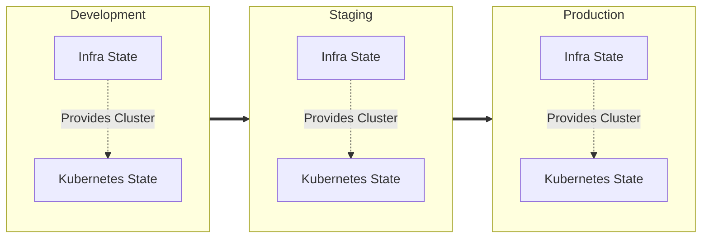
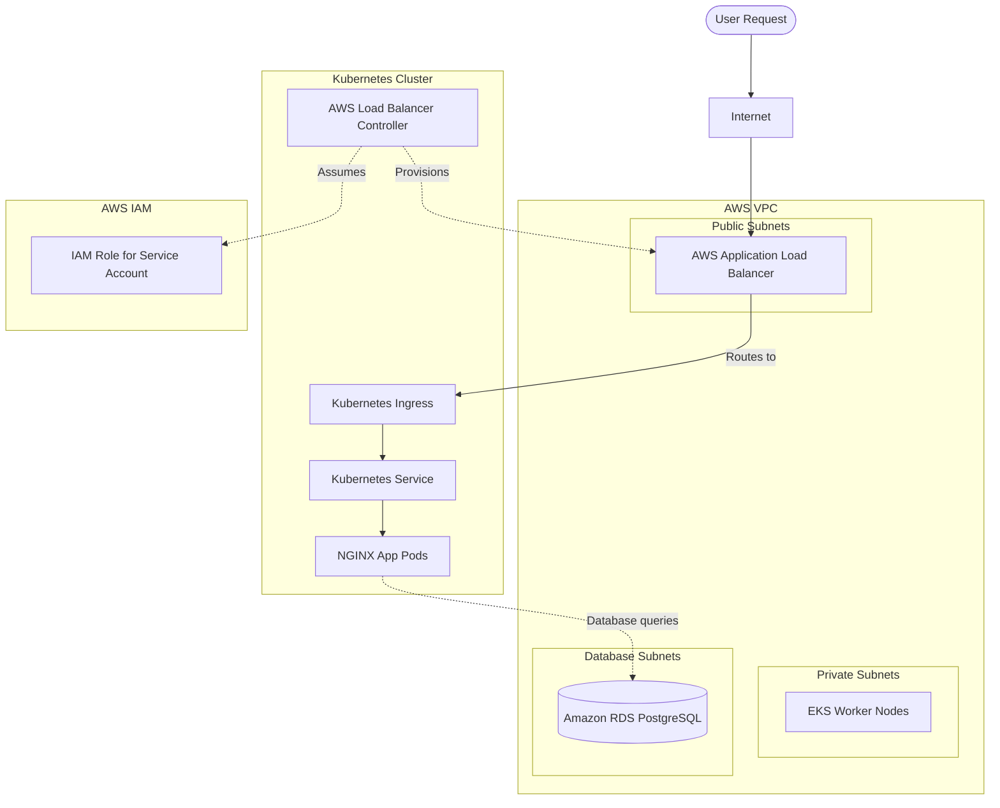

# Production-Style Amazon EKS Infrastructure with Terraform

This project demonstrates a production-style, multi-environment Kubernetes infrastructure on AWS built entirely with Terraform. It separates core AWS infrastructure from Kubernetes-level workloads, enforcing a strict layer boundary for safe and predictable deployments.

**Technology Stack:**
- **Cloud:** AWS (VPC, EKS, RDS PostgreSQL, IAM, ALB)
- **IaC:** Terraform
- **Orchestration:** Kubernetes
- **Package Manager:** Helm
- **Ingress:** AWS Load Balancer Controller
- **CI/CD:** GitHub Actions (OIDC integration)

---

## Three-Stage Environment Architecture

The infrastructure is promoted across three identical but isolated environments. Each environment strictly separates the **AWS infrastructure layer** from the **Kubernetes application layer**, resulting in distinct Terraform states.



*Note: Terraform workspaces are intentionally avoided. Physical directory separation ensures complete isolation and blast-radius containment.*

## Infrastructure Architecture

This diagram illustrates the actual components deployed by this project. The AWS infrastructure creates the foundation, while the Kubernetes layer deploys the Ingress controller and application.



## Technology & Architecture Layers

| Layer | Technology | Purpose |
|------|------------|---------|
| **IaC** | Terraform | Provision all infrastructure and applications |
| **Network** | AWS VPC | Network isolation (Public, Private, Database subnets) |
| **Compute** | Amazon EKS | Managed Kubernetes control plane |
| **Nodes** | EKS Managed Node Groups | Run application workloads securely |
| **Ingress** | AWS Load Balancer Controller | Dynamically provision AWS ALBs |
| **IAM** | IAM + IRSA | Pod-level least-privilege AWS permissions |
| **Database** | Amazon RDS PostgreSQL | Persistent relational database |
| **Packaging**| Helm | Standardized installation of the LBC |
| **CI/CD** | GitHub Actions | Automated Terraform formatting, init, and validation |

## Project Structure

The repository is organized by environment and layer.

```text
environments/
├── dev/
│   ├── infra/          # AWS VPC, EKS, RDS, IAM, IRSA
│   └── kubernetes/     # Helm (LBC), Namespace, Deployment, Service, Ingress
├── staging/
│   ├── infra/
│   └── kubernetes/
└── prod/
    ├── infra/
    └── kubernetes/

modules/
└── kubernetes/         # Reusable local module for the Kubernetes application

backend/                # Initial bootstrap for the S3 remote state bucket

.github/workflows/      # CI/CD pipeline configuration
```

## How the Deployment Works

1. **Bootstrap Backend:** A separate Terraform root (`backend/`) creates the S3 bucket to store all future state files.
2. **Deploy Infra Layer:** Terraform provisions the VPC, RDS, and EKS cluster.
3. **Deploy Kubernetes Layer:** Terraform authenticates to the newly created EKS cluster.
4. **Install Controller:** The `hashicorp/helm` provider installs the AWS Load Balancer Controller.
5. **Deploy Application:** The custom Kubernetes module deploys the NGINX app and its Ingress.
6. **Provision ALB:** The AWS Load Balancer Controller detects the Ingress and provisions the AWS ALB.
7. **Promotion:** This exact process is repeated for Staging, then Prod.

*(Crucial: The `infra` layer must be fully deployed before the `kubernetes` layer can be initialized.)*

## Quick Start

### 1. Prerequisites
- AWS CLI configured with administrator access
- Terraform `~> 1.6` installed
- `kubectl` installed

### 2. Bootstrap State Backend
```bash
cd backend
terraform init
terraform apply
```
*Note the output S3 bucket name. Update `backend.tf` in all environment layers with this bucket name.*

### 3. Deploy Dev Infrastructure
You must provide the RDS master password via a variable or environment variable.
```bash
cd environments/dev/infra
terraform init
terraform validate
terraform plan -var="db_password=YourSecurePassword123!"
terraform apply -var="db_password=YourSecurePassword123!"
```

### 4. Deploy Dev Kubernetes Application
The Kubernetes layer requires the EKS cluster name generated by the infra layer.
```bash
cd environments/dev/kubernetes

# Retrieve the cluster name from the infra state
CLUSTER_NAME=$(terraform -chdir=../infra output -raw eks_cluster_name)

terraform init
terraform plan -var="cluster_name=$CLUSTER_NAME"
terraform apply -var="cluster_name=$CLUSTER_NAME"
```

### 5. Verification
Connect your local `kubectl` to the new cluster:
```bash
aws eks update-kubeconfig --region us-east-1 --name eks-three-stage-dev-cluster
```

Check the resources:
```bash
kubectl get nodes
kubectl get pods -n app
kubectl get ingress -n app
```

Retrieve the ALB URL (it may take 2-3 minutes for AWS to provision the ALB):
```bash
kubectl get ingress nginx-app -n app -o jsonpath='{.status.loadBalancer.ingress[0].hostname}'
```
Paste the URL in your browser to see the NGINX welcome page.

## Environment Comparison

| Environment | Purpose | Infrastructure | Kubernetes |
|-------------|---------|----------------|------------|
| **Dev** | Active development & testing | 1 Node, Single-AZ RDS, Single NAT Gateway | 2 Pod replicas |
| **Staging** | Pre-production validation | Identical architecture to prod (scaled down) | Identical structure to prod |
| **Prod** | Production workloads | Multi-AZ RDS, High-Availability Nodes | Production replica counts |

## Security Best Practices

- **Private EKS Nodes:** Worker nodes reside in private subnets with no direct internet access. Outbound traffic routes through a NAT Gateway.
- **Private RDS:** The PostgreSQL database is in a dedicated database subnet, reachable *only* from the EKS node security group. No public IP.
- **IRSA (IAM Roles for Service Accounts):** The AWS Load Balancer Controller pod assumes an IAM role via OIDC, preventing the need to attach broad AWS permissions to the EC2 worker nodes.
- **State Security:** Terraform state is stored remotely in S3 with encryption, versioning, and public access blocking enabled.

## State Management

State files are stored in S3 using a logical directory structure to prevent conflicts:

```text
S3 Bucket
├── dev/
│   ├── infra/terraform.tfstate
│   └── kubernetes/terraform.tfstate
├── staging/
│   ├── infra/terraform.tfstate
...
```
*State files contain sensitive data (like the RDS password). They are strictly excluded from Git via `.gitignore`.*

## Destroy Order

You must destroy the layers in reverse order. If you destroy the infra layer first, the Kubernetes layer will be orphaned and Terraform will hang trying to reach a deleted EKS API.

```bash
# 1. Destroy Kubernetes resources and ALB
cd environments/dev/kubernetes
terraform destroy -var="cluster_name=eks-three-stage-dev-cluster"

# 2. Destroy AWS Infrastructure
cd ../infra
terraform destroy -var="db_password=YourSecurePassword123!"
```

## Troubleshooting

- **"Unexpected Block" in IDE:** If your editor (like VS Code) reports `kubernetes` or `set` as unexpected blocks in the Helm provider, it means the IDE language server hasn't loaded the `.terraform` schema for that specific directory. Run `terraform init` in that directory and restart your IDE's language server.
- **Kubernetes Provider Timeout:** If `terraform plan` in the Kubernetes layer hangs, ensure your AWS CLI token hasn't expired and the EKS cluster actually exists in your AWS account.
- **No ALB Created:** If the Ingress exists but no ALB is created, check the AWS Load Balancer Controller logs:
  `kubectl logs -n kube-system -l app.kubernetes.io/name=aws-load-balancer-controller`
